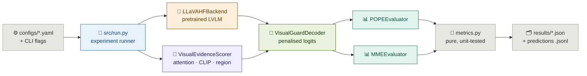

<div align="center">

[](https://github.com/ria0304/VisualGuard-LVLM)


# VisualGuard — Dynamic Visual Evidence-Guided Decoding for Hallucination Reduction in LVLMs


**Don't just ask what the model wants to say. Ask whether the image supports it.**

VisualGuard is a training-free, decoding-time intervention for Large Vision-Language Models. At every autoregressive step it scores each candidate token by how well the image corroborates it — using LVLM attention, CLIP similarity and open-vocabulary region detections — and penalises the logits of unsupported candidates *before* the next token is chosen.

</div>

---

> **Status: implementation complete, results not yet available.**
> This repository implements the method and a reproducible evaluation framework. **No experimental results are reported here, because no full benchmark run has been performed.** Every results table is generated from real result JSONs on disk; unmeasured cells are rendered as `not run`, never as zeros or estimates.

---

## The Problem

Large Vision-Language Models hallucinate: they describe objects that are not in the image.

The dominant failure is **confident hallucination** — the model assigns high probability to a token the image does not support, and greedy decoding commits to it. Once that token is in the context, every later token conditions on it.

Existing fixes each carry a cost:

- **Post-hoc editing** ("generate, check, rewrite") is expensive, can change the meaning of the answer, and cannot stop a hallucinated token from entering the context in the first place.
- **Fine-tuning-based mitigations** change the model, which makes comparison against the unmodified model unfair and costs training compute.
- **Attention-based analyses** conflate *where the model looks* with *what the model is justified in saying*. Attention is a weak, contested explanation signal, so relying on it alone is fragile.

---

## The Solution

VisualGuard leaves the model weights untouched and intervenes only at decoding time.

For each step, it takes the top-k candidate tokens, estimates a **Visual Evidence Score (VES)** per candidate from three complementary channels, and subtracts a penalty from the logits of candidates whose evidence falls below a threshold:

- **Attention evidence** — how much attention the decoding state places on the image tokens, plus candidate-embedding similarity to the image-token embeddings
- **Semantic evidence** — CLIP image–text similarity for the word being formed
- **Region evidence** — open-vocabulary detection confidence (Grounding DINO), optional

The system outputs:

- A **decoded answer** whose logits were corrected step by step
- An **intervention log** recording, per step, whether the evidence actually changed the chosen token
- **POPE metrics** — accuracy, precision, recall, F1, yes-ratio and hallucination rate, across the random / popular / adversarial settings
- **MME scores** — the official 14-subtask accuracy / accuracy+ protocol
- A **result JSON with full provenance** (seed, model, git commit, resolved config, library versions, runtime, peak GPU memory)

Because the method is training-free, every baseline and every ablation runs against **the same checkpoint, the same prompts and the same seed**, so measured differences are attributable to the decoding rule alone.

---

## Core Decoding Flow

```
Image + prompt
        ↓
Pretrained LVLM (weights unchanged) → next-token logits
        ↓
Candidate set (top-k by logit)
        ↓
Evidence estimation per candidate
  · AttentionEvidence  (LM attention + embeddings)
  · SemanticEvidence   (CLIP)
  · RegionEvidence     (Grounding DINO, optional)
        ↓
VES(t) = (α·Attn + β·Sem + γ·Region) / (α + β + γ)
        ↓
penalty(t) = λ · max(0, threshold − VES(t)) / threshold
        ↓
logit'_t = logit_t − penalty(t)   (content-bearing tokens only)
        ↓
Select next token → repeat autoregressively (KV-cached)
```

---

## Features

| Feature | Status |
|---|---|
| Training-free decoding-time intervention (no weight changes) | ✅ |
| Attention evidence (state-level image attention + candidate-embedding cosine) | ✅ |
| Semantic evidence (CLIP, normalised within the candidate set) | ✅ |
| Cheaper semantic evidence via feature caching | ✅ |
| Region evidence (Grounding DINO via Hugging Face `transformers`) | ✅ |
| Thresholded penalty (zero when `VES ≥ threshold`) | ✅ |
| Function-word / punctuation exemption | ✅ |
| Baselines: greedy, sampling, beam search | ✅ |
| Ablation methods: attention, semantic, region, attention + semantic, full | ✅ |
| KV-cached manual decoding loop | ✅ |
| Per-step intervention audit trail | ✅ |
| Byte-identical decoding comparison (length penalty, repetition penalty) | ✅ |
| POPE evaluation (random / popular / adversarial) | ✅ |
| MME evaluation (official 14-subtask protocol) | ✅ |
| Ablation runner + results-table builder (one row per run, `not run` for missing cells) | ✅ |
| Provenance block in every result JSON, recording the token budget that actually ran | ✅ |
| YAML configs with inheritance + CLI overrides (unknown keys raise) | ✅ |
| 4-bit / 8-bit quantisation (CUDA) | ✅ |
| Unit + integration tests, no downloads required (297+ tests) | ✅ |
| HallusionBench skeleton (evaluator + data loader) | ✅ |
| Full benchmark results | ❌ Not yet run |
| MME capability trade-off quantification | ❌ Not yet measured |
| LVLM backends other than LLaVA-family | ❌ Extension point only |
| Long-form captioning evaluation | ❌ Not wired in |

---

## Method

### Visual evidence score

All channels are mapped into `[0, 1]` and combined as a weighted mean:

```
VES(t) = α · AttentionEvidence(t) + β · SemanticEvidence(t) + γ · RegionEvidence(t)
         ─────────────────────────────────────────────────────────────────────────
                                      α + β + γ
```

Dividing by the sum of the weights that are actually switched on keeps `VES` in `[0, 1]` however many channels are enabled, so a one-channel ablation is directly comparable to the full method.

**A channel that could not be measured contributes `0.5`, not `0.0` and not `1.0`.** This is load-bearing rather than cosmetic. Each channel is normalised *within the candidate set*, and an all-equal candidate set is a zero-span range — so feeding a constant through min-max maps it to `1.0`, i.e. *maximum* evidence. An unmeasured channel would therefore have reported full support, pushed `VES` above `threshold`, and silently switched off the penalty for its own candidates. `0.5` is equally rank-preserving (every candidate still ties) without fabricating support. Unavailable channels say so in the run's `notes`.

**AttentionEvidence.** Self-attention rows belong to sequence *positions*, not candidate tokens, so attention alone cannot rank candidates within a step. The channel therefore mixes two components via `attention_candidate_mix` (`w`):

```
AttentionEvidence(t) = (1 − w) · image_attention + w · embed_cos(t)

  image_attention : attention mass the current query position places on the image-token
                    span, aggregated over a fraction of layers and heads
                    (mean / max / median), normalised by total attention mass
  embed_cos(t)    : cosine similarity between the candidate token's embedding and the
                    mean image-token embedding in LM hidden space
```

`w = 0` is purely state-level, `w = 1` purely candidate-level. Default `w = 0.5`.

Note the consequence of that decomposition: at `w = 0` the channel is a property
of the decoding *state*, so it is **identical for every candidate at a step** and
cannot re-order anything. A run with `alpha > 0` and `attention_candidate_mix = 0`
is therefore rejected by the runner — it would be unmodified greedy decoding
wearing an "attention only" label. `configs/attention.yaml` documents the knob but
keeps the default `0.5`.

**SemanticEvidence.** CLIP similarity between the image and the word fragment being formed (`image ↔ "dog"` vs `image ↔ "cat"`), min-max normalised within the candidate set so it is scale-free. Candidates are wrapped in a minimal caption template because CLIP scores bare nouns inconsistently.

**RegionEvidence.** Best detector confidence among open-vocabulary detections whose label supports the candidate phrase, min-max normalised within the candidate set like the other two channels.

The detector runs **once per image**, against a vocabulary fixed before generation starts (the question's content words, with prompt scaffolding filtered out). Running it per step is what makes region evidence impractical: a detector is orders of magnitude slower than an LM forward pass, and the phrase set changes every step. The cost is that a candidate phrase outside that vocabulary carries no information and scores `0.0` — a recorded limitation, not a silent staleness bug. Matching is on **whole tokens**, so `cat` does not match `cattle`.

Two failure modes are refused outright rather than papered over:

- A run with `gamma > 0` and no grounding backend is **rejected**. It would otherwise produce a constant `VES`, the penalty could never re-order anything, and the run would be indistinguishable from unmodified greedy while reporting a region ablation.
- The upstream `groundingdino` backend labels every box with the whole caption, which would give each vocabulary word the same top-box confidence. Boxes with no per-box phrase attribution are dropped rather than labelled with the caption, and a warning is logged.

### `threshold` is a percentile, not an absolute grounding level

Because every channel is normalised across the top-k candidates at the current step, `VES` is a **within-step ranking**. `threshold = 0.35` therefore selects roughly the weakest third of the top-k rather than "everything below a fixed amount of image support", and the penalty does not fire at all when all candidates score closely. This is stated rather than hidden, because it changes what a `VES` number means; absolute calibration would need a channel normalised across the vocabulary rather than across the candidate set.

### Hallucination penalty

```
penalty(t) = λ · max(0, threshold − VES(t)) / threshold
logit'_t   = logit_t − penalty(t)
```

Two deliberate choices:

- **The penalty is thresholded, not uniform.** `penalty = 0` whenever `VES(t) ≥ threshold`. Penalising every token equally would shift the whole distribution and damage fluency for no hallucination benefit.
- **Only content-bearing tokens are penalised.** Articles, auxiliaries, prepositions and punctuation are flagged by a conservative lexical filter and exempt by default (`penalise_function_words: false` in all shipped configs). Rewriting function words is the fastest way to break generation quality.

Note that the filter sees *sub-word fragments* — `is_content_bearing` is asked about `"ph"` and `"pho"` while `"photograph"` is being formed — so intervention strength depends partly on the tokenizer's vocabulary. See *Known Limitations*.

### Methods compared

All share one LVLM, one prompt template and one seed:

| `--method` | Decoding rule | Needs detector |
|---|---|---|
| `baseline` / `greedy` | Unmodified greedy | — |
| `sampling` | Unmodified sampling at temperature `T` | — |
| `beam` | Unmodified beam search | — |
| `attention` | VisualGuard with `β = γ = 0` | — |
| `semantic` | VisualGuard with `α = γ = 0` | — |
| `region` | VisualGuard with `α = β = 0` | ✅ |
| `unidirectional` | Attention + semantic | — |
| `visualguard` | All channels | Only if `γ > 0` |

Baselines run through the standard `model.generate` path and never build an evidence scorer, so they do not pay the evidence cost and cannot be accidentally modified.

---

## Research Hypothesis

For a candidate continuation `t`, the degree to which the image corroborates `t` is measurable from complementary, partially independent signals (LVLM attention, image–text semantic similarity, open-vocabulary region detections). Penalising candidates whose support falls below a threshold should reduce object hallucination, and the *cost* in general capability should be governed by how narrowly the penalty is targeted.

This is a hypothesis, not a finding. It has not been tested on any benchmark in this repository. The ablation grid is designed so that it **can fail**.

---

## Architecture



---

## Tech Stack

**Model and evidence**
- PyTorch + Hugging Face `transformers` (default backbone: `llava-hf/llava-1.5-7b-hf`)
- CLIP (`openai/clip-vit-base-patch32`) for semantic evidence
- Grounding DINO (`IDEA-Research/grounding-dino-base`, via `transformers`; upstream `groundingdino` optional) for region evidence
- `accelerate`, optional `bitsandbytes` for 4-bit / 8-bit loading

**Evaluation and tooling**
- POPE and MME loaders with strict label and image validation
- PyYAML configs with `defaults:` inheritance
- `pycocotools`, Pillow, NumPy, `tqdm`
- pytest

---

## Project Structure

```
VisualGuard-LVLM/
│
├── src/
│   ├── run.py                        # Experiment runner / CLI + provenance capture
│   ├── model/
│   │   ├── llava_backend.py          # Pretrained LVLM loading + KV-cached decode steps
│   │   ├── visual_evidence.py        # VES channels, combination, penalty
│   │   ├── visual_guard_decoder.py   # Decoding-time intervention + baselines
│   │   └── grounding.py              # Optional Grounding DINO backend
│   ├── data/                         # POPE / MME / COCO loaders (strict validation)
│   │   ├── pope.py
│   │   ├── mme.py
│   │   └── coco.py
│   ├── evaluation/
│   │   ├── pope_eval.py              # POPE evaluation
│   │   ├── mme_eval.py               # MME evaluation
│   │   └── metrics.py                # Accuracy / P / R / F1 / hallucination rate / MME
│   └── utils/
│       ├── config.py                 # YAML + CLI config resolution
│       └── reproducibility.py        # Seeding, versions, device, git commit
│
├── configs/
│   ├── visualguard.yaml              # Full method (base config)
│   ├── baseline.yaml                 # All weights zero — unmodified decoding
│   ├── attention.yaml                # Attention-only ablation
│   ├── semantic.yaml                 # Semantic-only ablation
│   ├── region.yaml                   # Region-only ablation (needs a detector)
│   └── unidirectional.yaml           # Attention + semantic
│
├── scripts/
│   ├── run_ablations.py              # Runs the full ablation grid + lambda sweep
│   ├── make_results_table.py         # Builds the comparison table from result JSONs
│   └── smoke_test.py                 # End-to-end plumbing check on a small real LVLM
│
├── tests/
│   ├── test_metrics.py
│   ├── test_visual_evidence.py
│   ├── test_decoder_intervention.py
│   ├── test_llava_backend.py
│   ├── test_config_and_data.py
│   ├── test_evaluators_integration.py
│   └── test_make_results_table.py
│
├── results/                          # Run outputs (gitignored except .gitkeep)
├── requirements.txt
└── .gitignore
```

---

## Run Locally

**Step 1 — Clone and install**

```bash
git clone https://github.com/ria0304/VisualGuard-LVLM.git
cd VisualGuard-LVLM

python -m venv .venv && source .venv/bin/activate
pip install --upgrade pip
pip install -r requirements.txt
```

Optional extras:

```bash
pip install bitsandbytes          # for --quantization 4bit / 8bit (CUDA only)
pip install groundingdino         # only if you prefer the upstream detector
```

**Step 2 — Verify the install** (no downloads required)

```bash
python -m pytest tests -q
```

**Step 3 — Get the data**

No datasets or checkpoints are committed. Obtain each from its official release.

*POPE* (Li et al., 2023) — expected layout:

```
<data-root>/
    coco_pope_random.jsonl
    coco_pope_popular.jsonl
    coco_pope_adversarial.jsonl
```

Each row has `question_id`, `image`, `text`, `label` (`yes` / `no`). `--image-root` must point at the COCO images referenced by `image` (typically `val2017`).

| Setting | How the absent object is sampled |
|---|---|
| `random` | Uniformly at random |
| `popular` | Biased toward frequently occurring objects |
| `adversarial` | By co-occurrence with ground-truth objects |

All three are required for a complete table.

*MS COCO 2017* (image source for POPE):

```bash
wget http://images.cocodataset.org/zips/val2017.zip
wget http://images.cocodataset.org/annotations/annotations_trainval2017.zip
unzip val2017.zip && unzip annotations_trainval2017.zip
```

*MME* (Yin et al., 2023) — expected layout, with 10 Perception and 4 Cognition subtasks:

```
<data-root>/<subtask>/<subtask>.jsonl
<data-root>/<subtask>/images/*.jpg
```

**Step 4 — Run a baseline**

```bash
python -m src.run \
    --benchmark pope \
    --method baseline \
    --model llava-hf/llava-1.5-7b-hf \
    --device cuda \
    --dtype float16 \
    --data-root /path/to/POPE \
    --image-root /path/to/coco/val2017 \
    --output-dir results
```

Other baselines:

```bash
python -m src.run --benchmark pope --method sampling --temperature 1.0 ...
python -m src.run --benchmark pope --method beam --num-beams 4 ...
```

**Step 5 — Run VisualGuard**

```bash
python -m src.run \
    --benchmark pope \
    --method visualguard \
    --config visualguard \
    --alpha 1.0 --beta 1.0 --gamma 0.0 \
    --lambda 0.5 --threshold 0.35 --top-k 50 \
    --model llava-hf/llava-1.5-7b-hf \
    --data-root /path/to/POPE \
    --image-root /path/to/coco/val2017
```

With region evidence (requires a grounding backend):

```bash
python -m src.run --benchmark pope --method visualguard \
    --gamma 0.5 --grounding-backend hf_grounding_dino ...
```

If the backend is unavailable the run **fails with install guidance** rather than silently degrading.

`--grounding-backend none` disables the channel explicitly — but a run that sets `gamma > 0` without a backend is **rejected outright**, because it would produce a constant `VES` that cannot re-order any candidate. Such a run is indistinguishable from unmodified greedy while claiming to be a region ablation, so the runner refuses it and says what to pass instead.

**Step 6 — Build the ablation table**

```bash
python scripts/run_ablations.py \
    --benchmark pope \
    --data-root /path/to/POPE \
    --image-root /path/to/coco/val2017 \
    --model llava-hf/llava-1.5-7b-hf \
    --device cuda \
    --lambda-sweep 0.25,0.5,1.0 \
    --grounding-backend hf_grounding_dino

python scripts/make_results_table.py --results-dir results
```

Each row is run against its **shipped YAML** (`--config <name>`), so the row that is
measured is the row that is documented. Add `--dry-run` to print the commands, or
`--smoke` for a two-samples-per-split pipeline check (not comparable to a real
run, and labelled as such). Rows D and F need a detector and are skipped with a
warning when `--grounding-backend none` is given.

The table has **one row per run, not per method name**. Rows F, G and every
lambda-sweep point all record `method: visualguard`, so keying on the method alone
would silently drop all but one of them. Rows whose weights are not canonical for
their method are labelled with those weights, e.g.
`visualguard variant [a1 b0 g1 lam0.5]`.

---

## Verify the pipeline is working

Run the smoke test against a small **real** LLaVA-family checkpoint (about 1.7 GB, CPU-friendly):

```bash
python scripts/smoke_test.py
python scripts/smoke_test.py --skip-clip     # skip the CLIP channel
```

It validates model loading, the processor, image-token span detection, attention extraction, the KV-cached decoding loop, baseline `generate`, and the CLIP channel. It reports **no accuracy figures** — the small checkpoint it uses for speed is not the experiment model, and its numbers must never be reported.

For a quick, cheap dry run of a real benchmark, cap the samples (results are then flagged as not comparable to a full run):

```bash
python -m src.run --benchmark pope --method visualguard --max-samples 50 ...
```

---

## Evaluation

### POPE

Computed by `src/evaluation/metrics.py`:

- **Accuracy**, **Precision**, **Recall**, **F1** (positive class = "yes")
- **Yes ratio / No ratio** — exposes degenerate all-yes answering
- **Hallucination rate** — `FP / (all "no" items)`, isolating the targeted failure of asserting a nonexistent object

Per-sample predictions are written to `results/pope_<setting>_<method>_predictions.jsonl`, so any run can be re-scored or audited without re-running the model.

Three honesty guards:

1. An answer that cannot be parsed as yes/no is counted as an error and reported
   separately as `unparseable`. It is never coerced to a class, and it is *not*
   folded into the false positives — it contains no assertion about the object,
   so counting it as one would report a model that emitted garbage as
   hallucinating 100% of the time.
2. `yes_ratio` / `no_ratio` are computed over **parseable** answers only, so they
   measure yes-tilting rather than parse-failure rate. Runs whose yes-ratio
   exceeds 0.95 are flagged, because such a model can look good on recall while
   being useless.
3. `hallucination_rate` is `FP / (all "no" items)`, and is likewise unaffected by
   unparseable answers.

### MME

Implements the official MME protocol in full — no external evaluator service and no simulated score:

`accuracy` is per **question**, not a macro-average over images, so a truncated
run still follows the official definition. Subtask scores are summed into the two
categories and then added; `perception_subtasks_measured` /
`cognition_subtasks_measured` record how many subtasks contributed, so a run where
nothing ran is distinguishable from a run where every subtask scored zero.

```
accuracy      = correct questions / all questions
accuracy_plus = images where BOTH questions are correct / all images
score         = 100 · (accuracy + accuracy_plus)          # per subtask, max 200
category      = sum of subtask scores                    # perception / cognition
total         = perception_score + cognition_score
```

14 subtasks — Perception: existence, count, position, color, posters, celebrity, scene, landmark, artwork, OCR. Cognition: commonsense_reasoning, numerical_calculation, text_translation, code_reasoning.

**Scope note.** This reproduces the classic 14-subtask yes/no MME benchmark. MME variants that use a GPT-based judge are a different protocol and are *not* reproduced or approximated.

### Ablation grid

| Row | Method | Channels |
|---|---|---|
| A | `baseline` | none (unmodified greedy) |
| B | `attention` | attention only |
| C | `semantic` | CLIP only |
| D | `region` | detector only |
| E | `unidirectional` | attention + semantic |
| F | `visualguard` (`β = 0`) | attention + region |
| G | `visualguard` | all channels |
| — | λ sweep | full method at several penalty strengths |

Rows D and F are skipped with a warning if no grounding backend is enabled, because without a detector they would measure nothing.

The table builder emits:

```
| Method | POPE Random F1 | POPE Popular F1 | POPE Adv F1 | Hallucination | POPE worst-setting F1 | MME total |
```

`POPE worst-setting F1` is included on purpose: reporting only the best setting would hide the method's weak cases. Missing runs render as `not run`, and the script warns when rows used different models, seeds or `--max-samples`, since such rows are not comparable.

---

## Reproducibility

Every result JSON embeds a `provenance` block: UTC timestamp, seed, model id, the exact command, resolved config, platform, CPU count, GPU name and memory, library versions (Python, torch, transformers, accelerate, bitsandbytes, numpy, PIL), git commit and dirty-tree flag — plus `total_runtime_s` and peak GPU memory.

```bash
python -m src.run ... --seed 42
```

`--no-deterministic` relaxes determinism for speed. Seeding reduces variance rather than eliminating it: PyTorch does not guarantee bit-identical results across different GPUs, CUDA versions or kernels.

---

## Repository Guarantees

These are enforced in code, not merely intended:

| Guarantee | Enforcement |
|---|---|
| No random / fake images | `src/data/*.py` resolve real paths and raise with the probed locations; `require_images=True` by default |
| No fabricated metrics | `pope_metrics` / `mme_subtask_scores` raise on empty input rather than returning `0.0` |
| No hidden synthetic evidence | A requested grounding backend raises `GroundingUnavailable`; it never falls back to the null backend |
| Unmeasurable channels are neutral | A channel that cannot be measured contributes `0.5` and records a note. It is never allowed through the min-max normaliser, which would map a constant to `1.0` (maximum evidence) and disable the penalty |
| A constant channel is refused | `gamma > 0` with `--grounding-backend none`, or `alpha > 0` with `attention_candidate_mix = 0`, raises at config-resolution time — before the checkpoint is downloaded — instead of producing a run identical to greedy |
| Unparseable answers surfaced | Counted in `total` and reported as `unparseable`, never coerced, and never counted as false positives or hallucinations |
| Unknown config keys rejected | `build_configs` raises on any key no dataclass claims, **and** on any key two dataclasses both claim |
| Every run gets its own table row | The results table keys on `provenance.run_name`; rows sharing a `method` are disambiguated by their evidence weights |
| Comparability checks cannot crash | The model/seed/max-samples checks tolerate missing and `null` provenance instead of raising while trying to report a problem |
| Runtime errors are not swallowed | Optional-keyword support is decided by signature inspection, so a `TypeError` from inside the decoder propagates instead of triggering a silent retry at different settings |
| Interventions auditable | `GenerationResult.interventions` / `interventions_detail` record whether evidence changed the chosen token |
| Datasets / checkpoints uncommitted | `.gitignore` excludes `*.jsonl`, `*.safetensors`, `*.pt`, `results/*` and dataset folders |
| Mocks confined to tests | Stubs and synthetic tensors appear only under `tests/` and `scripts/smoke_test.py`; benchmarks use real data exclusively |

---

## Common Issues

| Problem | Fix |
|---|---|
| `--data-root is required` | Pass the POPE / MME root; the runner validates dataset paths *before* loading the model |
| `Grounding backend unavailable` (exit code 3) | `pip install transformers>=4.40`, or rerun with `--grounding-backend none --gamma 0` |
| Attention evidence is empty / errors | Use `--attn-implementation eager` (the default); fused kernels do not return attention matrices |
| `CUDA out of memory` | Use `--dtype float16` or `--quantization 4bit` |
| `--quantization` fails on CPU / macOS | bitsandbytes needs a CUDA device |
| `Unknown config keys` | A key in your YAML or flags matches no config dataclass — check for typos |
| Ablation rows D / F skipped | Expected without `--grounding-backend hf_grounding_dino` |
| Table shows `not run` | That run does not exist in `results/` yet — by design, never a zero |
| `gamma > 0` but `--grounding-backend none` | The run is rejected because it would measure no regions. Pass a backend, or `--gamma 0` |
| `attention_candidate_mix = 0` with `alpha > 0` | Rejected: without the candidate-level term the attention channel is a per-step constant. Use the default `0.5`, or `--alpha 0` |
| Two table rows look identical | Their configurations are identical too; the run name is appended to disambiguate |
| Rows flagged as non-comparable | Runs used different models, seeds or `--max-samples` |

---

## Deployment

Research code, run locally. No Dockerfile, no hosted service. Datasets, checkpoints and run outputs are gitignored.

---

## Configuration

Parameters live in `configs/*.yaml` and are overridden by CLI flags. Precedence: **dataclass defaults < YAML < CLI**. A YAML file can inherit from another with `defaults: <name>`.

| Flag | Default | Description |
|---|---|---|
| `--model` | `llava-hf/llava-1.5-7b-hf` | LVLM checkpoint. Must be identical across methods you compare |
| `--benchmark` | `pope` | `pope` or `mme` |
| `--method` | `baseline` | See *Methods compared* |
| `--config` | — | YAML under `configs/` (e.g. `visualguard`) |
| `--alpha` / `--beta` / `--gamma` | `1.0` / `1.0` / `0.0` (in `visualguard.yaml`) | Attention / semantic / region weights |
| `--lambda` | `0.5` | Penalty strength |
| `--threshold` | `0.35` | VES below this counts as insufficient visual support |
| `--top-k` | `50` | Candidate tokens scored per step |
| `--max-new-tokens` | benchmark | Generation length. The benchmark's budget wins: POPE 16, MME 32. The resolved config is updated to match, so provenance records what ran |
| `--clip-model` | `openai/clip-vit-base-patch32` | CLIP checkpoint for semantic evidence |
| `--grounding-backend` | `none` | `none`, `hf_grounding_dino` or `grounding_dino` |
| `--grounding-box-threshold` | `0.3` | Detector box confidence cutoff |
| `--device` / `--dtype` | `auto` / `auto` | Device and precision for the **LVLM**. In a YAML these keys mean the model; use `grounding_dtype` for the detector |
| `--quantization` | `none` | `none`, `4bit`, `8bit` |
| `--attn-implementation` | `eager` | Must stay `eager` for attention evidence |
| `--setting` | all three | Single POPE setting |
| `--mme-subtask` | all | Restrict MME to given subtasks (repeatable) |
| `--max-samples` | — | Cap samples per split — results then **not comparable** to a full run |
| `--seed` | `42` | Random seed |
| `--no-deterministic` | off | Allow non-deterministic kernels |
| `--output-dir` / `--run-name` | `results/` / auto | Where results are written |

Attention aggregation (`layer_fraction`, `head_aggregation`, `layer_aggregation`, `attention_candidate_mix`) and `normalize` are set in YAML.

A key claimed by more than one config dataclass is **rejected** as ambiguous rather
than bound to whichever class happened to be considered first — `dtype` exists on
both the model and the detector, and silently picking a winner would leave the user
no way to notice. Unset CLI flags are `None` and never overwrite a YAML value.

---

## Output Files

| File | Contents |
|---|---|
| `results/<run-name>.json` | Metrics, efficiency, provenance, resolved config |
| `results/pope_<setting>_<method>_predictions.jsonl` | Per-sample predictions for re-scoring / auditing |

Exit codes from `src.run`: `0` success · `2` configuration error · `3` grounding backend unavailable · `4` model / backend load failure · `5` dataset problem.

---

## Known Limitations

**Method**

- **Attention is not a faithful explanation of model behaviour.** `image_attention` is a *state-level* signal; candidate ranking genuinely comes from the embedding and semantic channels. The split is exposed as `attention_candidate_mix` rather than hidden.
- **Semantic evidence applies to the word fragment being formed**, so evidence for a multi-token word is only available mid-word. This is why the CLIP call dominates per-step cost.
- **Grounding DINO is open-vocabulary and error-prone.** A missed detection is indistinguishable from an absent object, which pushes the penalty the wrong way.
- **POPE answers are a single token**, so attention evidence rests almost entirely on the prefill row. Conclusions about POPE do not automatically transfer to long-form captioning.
- **CLIP is a noisy judge, not ground truth.** It is trained on web image–text data and carries its own biases.
- **Region evidence is off by default** because the detector is the dominant cost and the most fragile dependency.
- **`threshold` is a percentile, not an absolute level.** Every channel is normalised across the top-k candidates at the current step, so `VES` is a within-step ranking. `threshold = 0.35` selects roughly the weakest third of the top-k rather than everything below a fixed amount of image support, and the penalty does not fire when all candidates score closely. Absolute calibration would need a channel normalised across the vocabulary.
- **The penalty can only reorder within the top-k.** Candidates are drawn from the top-k by logit, so VisualGuard can promote one of those over another but can never pull in a token outside the set.
- **The penalty is applied to sub-word fragments.** `is_content_bearing` sees `"ph"` and `"pho"` while `"photograph"` is being formed, so intervention strength partly depends on the tokenizer's vocabulary.
- **Region vocabulary is fixed before generation.** The detector runs once per image against the question's content words, so a correct answer that was never asked about scores `0.0` — indistinguishable from a hallucination on the region channel.

**Engineering**

- **LLaVA-family only.** `LVLMBackend` defines the extension point, but no second LVLM is implemented, so pluggability is structural rather than demonstrated.
- **Much slower than greedy decoding.** One forward pass per step plus one CLIP forward per step. See `efficiency` in any result JSON.
- **Capability cost is unquantified.** MME cost is measured by the framework, but no experiment has been run yet.
- **HallusionBench is not wired in.** No loader or evaluator exists, and none is claimed.
- **Baseline and VisualGuard do not decode under byte-identical conditions.** Baselines go through HF `model.generate`, which merges the checkpoint's `generation_config` (length penalty, suppression tokens); the VisualGuard loop applies none of those, and ignores `repetition_penalty`. Attention matrices are also requested on every VisualGuard step, so the timing comparison across the table is not apples-to-apples.
- **Evidence scorers are stateful across a sample.** Image features, detections and LM embeddings are cached per image and reset at sample boundaries by the decoder. A caller driving `score_candidates` directly must do that itself.
- **The decoder is not thread-safe.** Per-sample mutable state (bindings, caches, the grounding backend) assumes one sample at a time; the benchmarks are sequential.

---

## Future Scope

| Feature | Why |
|---|---|
| Full benchmark results | Turn the hypothesis into a result — or falsify it with real data |
| Quantify the MME capability trade-off | Show what narrow penalties cost in general ability |
| Second LVLM backend | Demonstrate that the `LVLMBackend` interface is truly pluggable |
| Long-form captioning evaluation | POPE's single-token answers under-test the attention channel |
| Region vocabulary beyond pre-generation fix | Allow detector vocabulary to expand per decoding step |
| Absolute threshold calibration | Calibrate `threshold` across vocabulary rather than per-step candidate set |
| HallusionBench integration | A second hallucination benchmark beyond POPE |
| Cheaper semantic evidence (v2) | Approximate similarity or distilled CLIP alternative |

---

## Citation

The method in this repository is not yet published, so there is no citation to give. Please cite the benchmarks and prior work it builds on:

```bibtex
% POPE: Polling-based Object Hallucination Evaluation
@inproceedings{li2023evaluating,
  title     = {Evaluating Object Hallucination in Large Vision-Language Models},
  author    = {Li, Yuhang and others},
  booktitle = {Proceedings of the 2023 Conference on Empirical Methods in
               Natural Language Processing (EMNLP)},
  year      = {2023}
}

% MME: the 14-subtask multimodal evaluation benchmark
@article{fu2023mme,
  title   = {MME: A Comprehensive Evaluation Benchmark for Multimodal Large Language Models},
  author  = {Fu, Chaoyou and others},
  journal = {arXiv preprint arXiv:2306.13394},
  year    = {2023}
}

% LLaVA, the default backbone family
@inproceedings{liu2023visual,
  title     = {Visual Instruction Tuning},
  author    = {Liu, Haotian and others},
  booktitle = {Advances in Neural Information Processing Systems (NeurIPS)},
  year      = {2023}
}

% CLIP, used for the semantic evidence channel
@inproceedings{radford2021learning,
  title     = {Learning Transferable Visual Models From Natural Language Supervision},
  author    = {Radford, Alec and others},
  booktitle = {Proceedings of the 38th International Conference on Machine Learning (ICML)},
  year      = {2021}
}
```

Author lists are abbreviated to "and others" deliberately — consult the original papers before copying these entries into a manuscript.

No claim of state of the art, priority, superiority or statistical significance is made anywhere in this repository, because none has been demonstrated.
